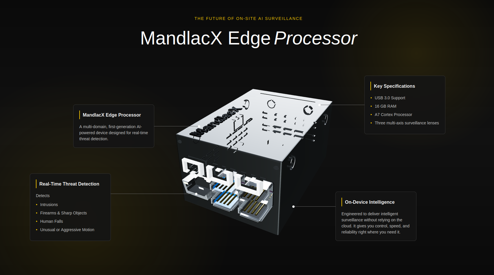

# 🧠 MandlacX Edge Processor — 3D Interactive Showcase

A futuristic 3D product showcase for the **MandlacX Edge Processor**, an AI-powered edge surveillance device. Built using **React Three Fiber**, custom Blender modeling, and raw CSS, this project delivers a smooth and visually compelling experience.

---

## ✨ Features

- 🎛️ **3D Model Integration** – Custom-designed in Blender and imported via `gltfjsx`
- 🌐 **Real-time rendering** with `@react-three/fiber` and `@react-three/drei`
- 💡 Dynamic lighting with ambient and directional lights
- 🎨 Clean, minimalist layout using pure CSS
- ⚙️ Modular React structure for scalability

---

## 🛠️ Tech Stack

- **React**
- **React Three Fiber**
- **@react-three/drei**
- **Blender** (3D modeling)
- **GLTF JSX** (model conversion)
- **CSS** (no frameworks)

---

## 📦 Installation

Clone the repo and install dependencies:

```bash
git clone https://github.com/anujnishad/madnlac-3d.git
cd mandlacx-edge-processor
npm install
npm run dev
```

> Make sure the GLB file is located in `public/models/smartSight.glb`

---

## 📁 Folder Structure

```
public/
  models/
    smartSight.glb       # Blender exported model
src/
  components/
    SmartSight.jsx            # Auto-generated JSX model
  App.jsx                # Main scene with Canvas + Lights + Info boxes
  index.css              # Styling
```

---

## 🖼️ Screenshot



🔗 **Live Demo:** [https://mandlac-3d.vercel.app/](https://mandlac-3d.vercel.app/)

---

## 📌 Future Plans

- 📱 Make it fully responsive
- 📜 Add scroll-based animations (parallax / camera movement)
- 🌍 Deploy to Vercel
- 🎮 Add hover/interactive feedback

---

## 🪪 License

MIT License — free to use, modify, and share.

---

## 🧑‍💻 Author

Made with ❤️ by [Anuj Nishad](https://github.com/anuj-nishad)
